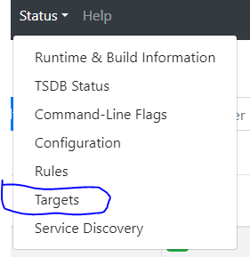
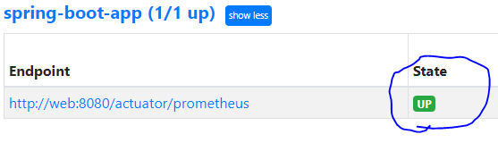
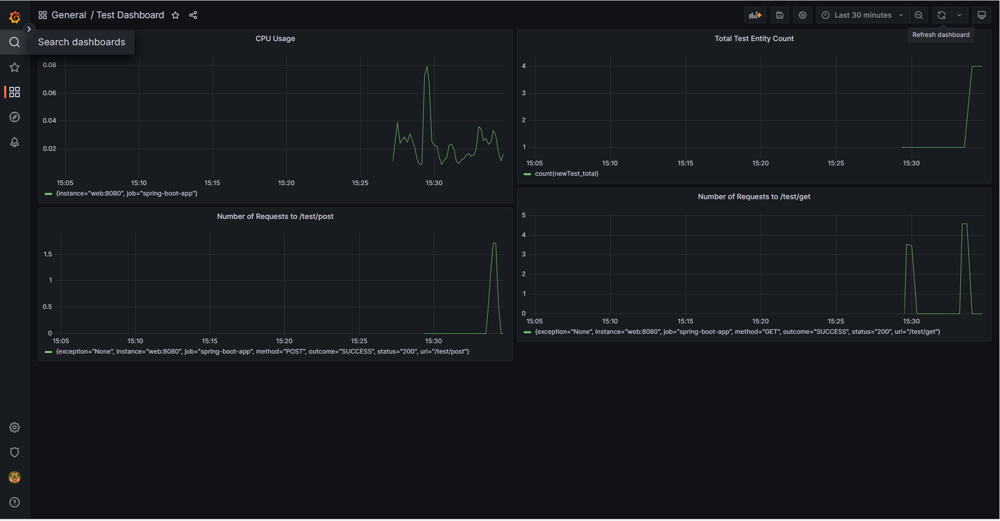

# Prometheus And Grafana Exercise App

---

### First Steps

* Move to home directory and run .sh file

        ./start.sh
* Or run the following command

        docker compose up -d
* Wait until all the containers are up and running

* Check the status of the containers

        docker ps
* Open the browser and go to http://localhost:9090 for Prometheus
* Check "spring-boot-app" Target is UP in Prometheus

* Open the browser and go to http://localhost:3000 for Grafana
* Login with the following credentials

        username: admin 
        password:admin
* Click on the `⚙` sign on the left side of the screen and select `Data Sources`
* Click on `Add data source` and select `Prometheus`
* Enter the following details
    
            URL: http://prometheus:9090
            Timeout: 8
            Scrap interval: 10s
            Query timeout: 10s  
            Type: Prometheus
            Version: > 2.40.x

* Click on `Save & Test` and you should see a green message saying `Data source is working`

* Click on `Dashboards` on the left side of the screen and select `Import`

* Click on `Upload .json file` and select the `Test-Dashboard.json` file from the `env` directory

* Click on `Import` and you should see a green message saying `Import successful`

* Click on `Home` on the left side of the screen and select `spring-boot-app`

* You should see the following dashboard

* Enjoy!

# Postman Collection

---

* Import the `prometheus-grafana-exercises.postman_collection.json` file from the `env` directory to Postman
